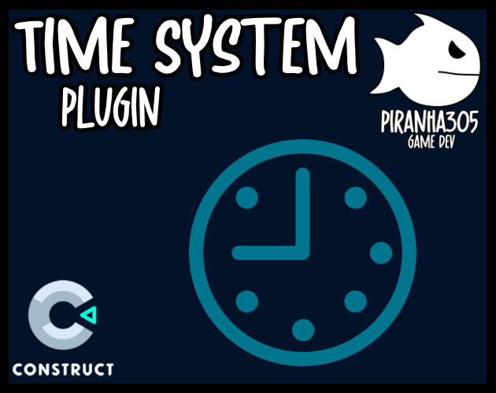
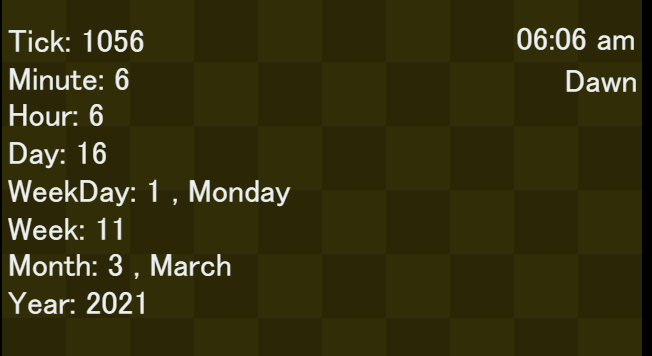
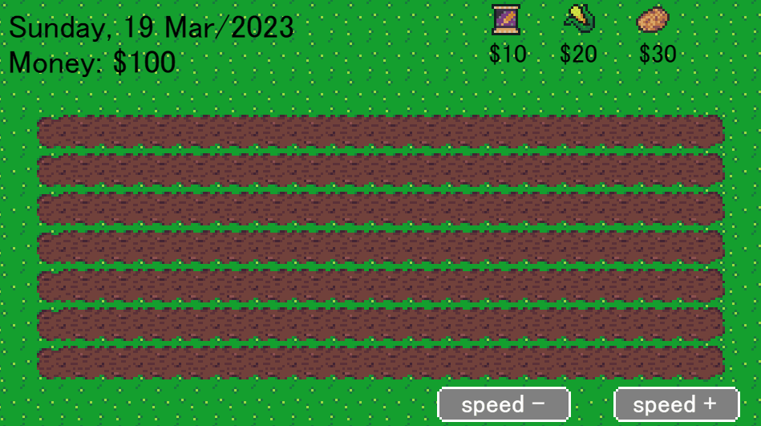

<br>
# Time System <br>
A construct plugin to manage in-game time. <br>
<br>
Author: piranha305 <br>
Website: https://piranha305.itch.io/ <br>
Addon Url: https://www.construct.net/en/make-games/addons/1101/time-system <br>
Download Latest Version : [Version: 1.0.0.1](https://github.com/armandoalonso/timesystem/releases/latest) <br>
<sub>Made using [c3ide2-framework](https://github.com/ConstructFund/c3ide2-framework) </sub><br>

## Table of Contents
- [Usage](#usage)
- [Examples Files](#examples-files)
- [Properties](#properties)
- [Actions](#actions)
- [Conditions](#conditions)
- [Expressions](#expressions)
---
## Usage
To build the addon, run the following commands:

```
npm i
node ./build.js
```

To run the dev server, run

```
npm i
node ./dev.js
```

The build uses the pluginConfig file to generate everything else.
The main files you may want to look at would be instance.js and scriptInterface.js

## Examples Files
- [piranha305_timesystem_example](./examples/piranha305_timesystem_example.c3p)
</br>
</br>

</br>

</br>

---
## Properties
| Property Name | Description | Type |
| --- | --- | --- |
| Enabled | Enable or disable the timne system behavior. (if disabled will not tick) | check |
| Tick Rate | How many seconds between each tick. (default 1) | float |
| Tick Duration Type | The type of tick duration. | combo |
| Ticks Per X | How many ticks per X(duration type). | float |
| Current Minute | The current minute. | integer |
| Current Hour | The current hour. | integer |
| Current Day | The current day. | integer |
| Current Month | The current month. | integer |
| Current Year | The current year. | integer |
| Current Day Of Week | The current day of the week. | combo |
| Day Phases | How many phases will trigger in the day. | combo |


---
## Actions
| Action | Description | Params
| --- | --- | --- |
| Start Time System | Starts the time system, enabled ticking |  |
| Stop Time System | Stops the time system, disables ticking |  |
| Set Tick Rate | Sets the tick rate. | Rate             *(number)* <br> |
| Set Ticks Duration | Sets the ticks per {x} duration. | Ticks             *(number)* <br>Type             *(combo)* <br> |
| Set Date | Sets the date. | Day             *(number)* <br>Month             *(number)* <br>Year             *(number)* <br> |
| Set Time | Sets the time. | Hour             *(number)* <br>Minute             *(number)* <br>Time Phase             *(combo)* <br> |
| Set Date Time | Sets the date and time. | Day             *(number)* <br>Month             *(number)* <br>Year             *(number)* <br>Hour             *(number)* <br>Minute             *(number)* <br>Time Phase             *(combo)* <br> |
| Set Day Of Week | Sets the day of week. (does not manipulate time) | Day             *(combo)* <br> |
| Add Date Time | Adds the specified amount of time to the current date and time. | Minutes             *(number)* <br>Hours             *(number)* <br>Days             *(number)* <br>Months             *(number)* <br>Years             *(number)* <br> |
| Set Alarm | Sets the alarm. will trigger OnAlaram condition when time is reached. | Tag             *(string)* <br>Hour             *(number)* <br>Minute             *(number)* <br>Time Phase             *(combo)* <br>Repeat             *(boolean)* <br> |
| Remove Alarm | Removes the alarm. | Tag             *(string)* <br> |
| Set Date Trigger | Sets the date trigger. will trigger OnDateTrigger condition when date is reached. | Tag             *(string)* <br>Day             *(number)* <br>Month             *(number)* <br>Year             *(number)* <br> |
| Remove Date Trigger | Removes the date trigger. | Tag             *(string)* <br> |
| Set Monthly Trigger | Sets the monthly trigger. will trigger OnMonthlyTrigger condition when date is reached. | Tag             *(string)* <br>Day             *(number)* <br> |
| Remove Monthly Trigger | Removes the monthly trigger. | Tag             *(string)* <br> |
| Set Yearly Trigger | Sets the yearly trigger. will trigger OnYearlyTrigger condition when date is reached. | Tag             *(string)* <br>Day             *(number)* <br>Month             *(number)* <br> |
| Remove Yearly Trigger | Removes the yearly trigger. | Tag             *(string)* <br> |
| Go To Next Hour | Goes to the next hour. |  |
| Go To Next Day | Goes to the next day. |  |
| Go To Next Month | Goes to the next month. |  |
| Go To Next Year | Goes to the next year. |  |
| Go To Next Day Phase | Goes to the next day phase. | Phase             *(combo)* <br> |
| Go To Next Season | Goes to the next season. |  |
| Load Json | Loads the json. | Json             *(string)* <br> |


---
## Conditions
| Condition | Description | Params
| --- | --- | --- |
| Is Ticking | Check if the time system is enabled and is ticking. |  |
| On Tick | Triggered every tick. |  |
| On Minute | Triggered every minute. |  |
| On Hour | Triggered every hour. |  |
| On Day | Triggered every day. |  |
| On Week | Triggered every week. |  |
| On Month | Triggered every month. |  |
| On Year | Triggered every year. |  |
| On Date/Time Changed | Triggered when any date/time value changes. |  |
| On Day Phase Change | Triggered when the day phase changes. |  |
| Day Phase Is | Check if the current day phase is the specified phase. | Phase *(combo)* <br> |
| On Season Changed | Triggered when the season changes. |  |
| Season Is | Check if the current season is the specified season. | Season *(combo)* <br> |
| Date/Time Is | Check if the current date/time is the specified date/time. | Day *(number)* <br>Month *(number)* <br>Year *(number)* <br>Hour *(number)* <br>Minute *(number)* <br>Time Phase *(combo)* <br> |
| Date Is | Check if the current date is the specified date. | Day *(number)* <br>Month *(number)* <br>Year *(number)* <br> |
| Time Is | Check if the current time is the specified time. | Hour *(number)* <br>Minute *(number)* <br>Time Phase *(combo)* <br> |
| Hour Is | Check if the current hour is the specified hour. | Hour *(number)* <br>Time Phase *(combo)* <br> |
| Day Is | Check if the current day is the specified day. | Day *(number)* <br> |
| Day Of Week Is | Check if the current day of the week is the specified day of the week. | Day *(combo)* <br> |
| Month Is | Check if the current month is the specified month. | Month *(number)* <br> |
| On Alarm | Triggered when the alarm is triggered. | Tag *(string)* <br> |
| On Date Trigger | Triggered when the date trigger is triggered. | Tag *(string)* <br> |
| On Monthly Trigger | Triggered when the monthly trigger is triggered. | Tag *(string)* <br> |
| On Yearly Trigger | Triggered when the yearly trigger is triggered. | Tag *(string)* <br> |


---
## Expressions
| Expression | Description | Return Type | Params
| --- | --- | --- | --- |
| CurrentTick | The current tick. | number |  | 
| CurrentMinute | The current minute. | number |  | 
| CurrentHour | The current hour. | number |  | 
| CurrentDay | The current day. | number |  | 
| CurrentWeek | The current week. | number |  | 
| CurrentMonth | The current month. | number |  | 
| CurrentYear | The current year. | number |  | 
| CurrentDayOfWeek | The current day of the week. | string |  | 
| CurrentDayName | The current day of the week. (full-name) | string |  | 
| CurrentDayShortName | The current day of the week. (short name) | string |  | 
| CurrentMonthName | The current month. (full-name) | string |  | 
| CurrentMonthShortName | The current month. (short name) | string |  | 
| CurrentTime24 | The current time in 24 hour format. | string |  | 
| CurrentTime12 | The current time in 12 hour format. | string |  | 
| CurrentDayPhase | The current day phase. | string |  | 
| CurrentSeason | The current season. | string |  | 
| TickRate | The tick rate. | number |  | 
| TicksPer | The ticks per {x} duration. | number |  | 
| AsJson | The time system as json. | string |  | 
